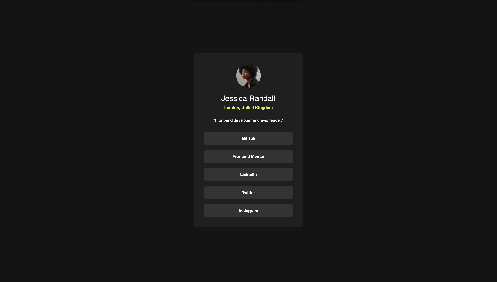
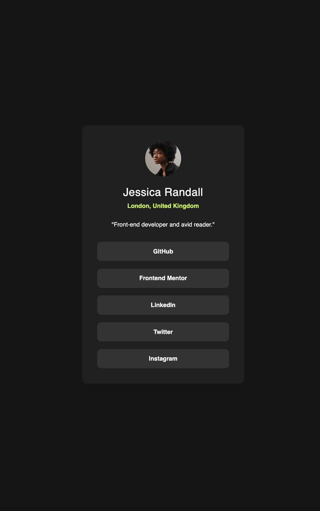

# Frontend Mentor - Social links profile solution

This is a solution to the [Social links profile challenge on Frontend Mentor](https://www.frontendmentor.io/challenges/social-links-profile-UG32l9m6dQ). Frontend Mentor challenges help you improve your coding skills by building realistic projects. 

## Table of contents

- [Overview](#overview)
  - [The challenge](#the-challenge)
  - [Screenshot](#screenshot)
  - [Links](#links)
- [My process](#my-process)
  - [Built with](#built-with)
  - [What I learned](#what-i-learned)
  - [Continued development](#continued-development)
  - [Useful resources](#useful-resources)
- [Author](#author)
- [Acknowledgments](#acknowledgments)

## Overview
A Website that showcases a profile of a user containing an avatar,some information about them, and a space to store social media links.

### The challenge

Users should be able to:

- See hover and focus states for all interactive elements on the page

### Screenshot




### Links

- Solution URL: [solution URL here](https://github.com/Yumi3113/social-links-profile-main)
- Live Site URL: [live site URL here](https://yumi3113.github.io/Social-Links-Profile-Challenge/)

## My process
First I created a style sheet linked it with the html file
then created classes of each section I want to style, this includes the username, avatar, each social media tab.
Moving on to the style sheet I created variables to store color and fonts for easier use.
I then set up the size font and color for each section and played around with the dimension to match the reference photo.

### Built with

- Semantic HTML5 markup
- CSS custom properties
- Flexbox
- CSS Grid
- Mobile-first workflow
- [React](https://reactjs.org/) - JS library
- [Next.js](https://nextjs.org/) - React framework
- [Styled Components](https://styled-components.com/) - For styles

### What I learned

I learnt how to; 

- link the style sheet to the html file:
  ```html
  <link rel ="stylesheet" href="style.css">
  ```

- Use classes from html to incorperate into css and create variables for easier use in css:
  ```html
      <p class="user-location">London, United Kingdom</p>
  ```
  ```css
  /*user-location class*/
  .user-location {
      color: var(--Green);
      font-weight: 600;
      margin-bottom: 1.7rem;
    }

  /*Variables*/
  :root {
      --Green: #c5f82a;
      
      --White: #ffffff;
      --Grey: #333333;
      --Dark-Grey: #1f1f1f;
      --Black: #141414;

      --ff: 'Inter', sans-serif;
      --fs-body: .875rem;
      --fs-heading: 1.6rem;
  }
  ```

- Create a hover effect and basic layout methods using css.
  ```css
  .list-item:hover {
      color: var(--Black);
      background: var(--Green);
  }
  ```

### Continued development

After making this project I now understand the basics of classes, how to layout and use effects but i noticed that some of my code are either redundant or overlap with others as I dont fully undertand what each property does. My next steps are to refine my understanding of css and learn better strategies or efficient ways to create certain layout or UI effects.

### Useful resources

- [w3schools](https://www.w3schools.com/css/) - This is a website that teaches CSS it goes through all the cool things you can do using css. I primarily used this website for layouting methods.

## Author

- Frontend Mentor - [@yumi#3113](https://www.frontendmentor.io/profile/yourusername)

## Acknowledgements
I used this code to add the hover effect:
- [w3schools](https://www.w3schools.com/howto/tryit.asp?filename=tryhow_css_buttons_fade3)